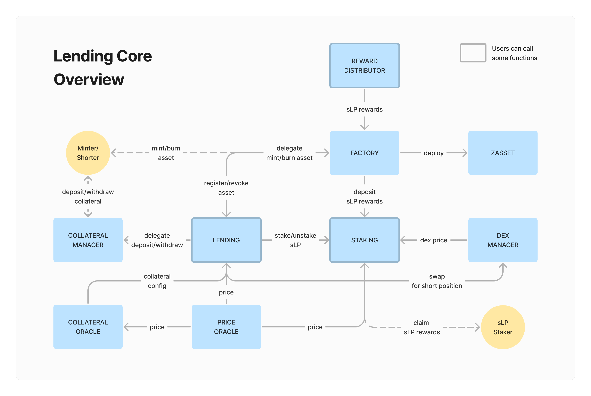

# Lending-Core

This repository contains lending-related contracts for Defiralia.

## Overview

## Functions for Acters

##### Minter/Shorter

- [openPositoin](docs/Lending.md###openPosition) (Lending)
- [deposit](docs/Lending.md###deposit) (Lending)
- [withdraw](docs/Lending.md###withdraw) (Lending)
- [mint](docs/Lending.md###mint) (Lending)
- [burn](docs/Lending.md###burn) (Lending)

##### Shorter

- [withdrawReward](docs/Staking.md###withdrawReward) (Staking)
- [adjustPremium](docs/Staking.md###adjustPremium) (Staking)
- [distribute](docs/RewardDIstributor.md###distribute) (RewardDIstributor)

##### Liquidator

- [liquidation](docs/Lending.md###liquidation) (Lending)

## Links

[Defiralia LP]
[Apps]
[Docs]
[Twitter]
[Discord]

## License

TBW
